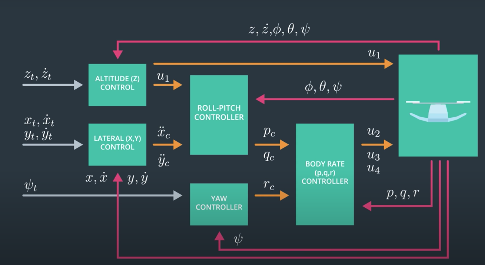

# FCND-3D-Quadrotor-Controller
In this project, a complete cascaded controller is going to be implemented in C++. Part of the control design relies on some math that one can find on the following paper [Feed-Forward Parameter Identification for Precise Periodic
Quadrocopter Motions](http://www.dynsyslab.org/wp-content/papercite-data/pdf/schoellig-acc12.pdf). 

