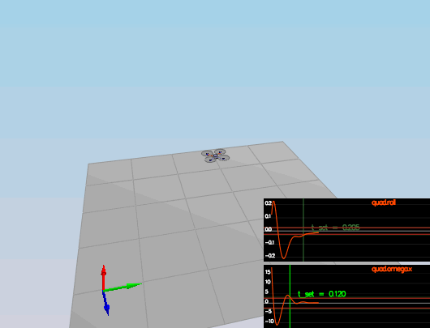
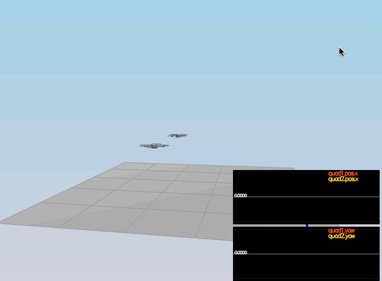
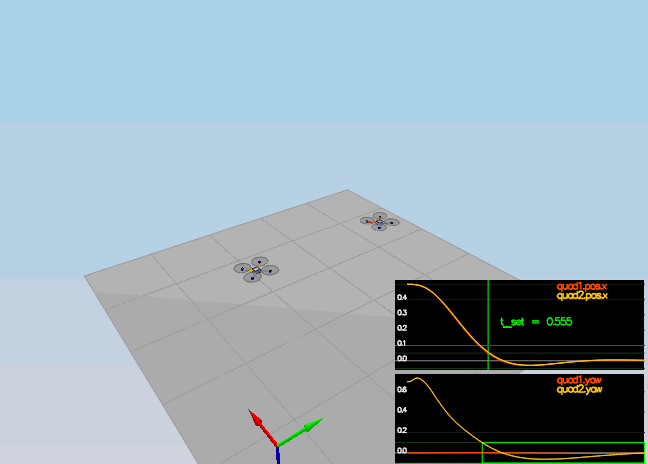
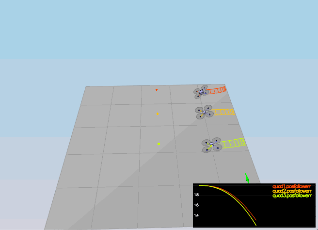
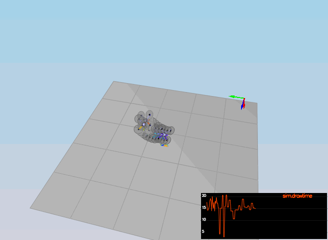

# FCND-3D-Quadrotor-Controller
In this project, a complete cascaded controller is going to be implemented in C++. Part of the control design relies on some math that one can find on the following paper [Feed-Forward Parameter Identification for Precise Periodic
Quadrocopter Motions](http://www.dynsyslab.org/wp-content/papercite-data/pdf/schoellig-acc12.pdf).


The diagram above summarizes the different control blocks that constitute the cascaded P and PD controllers.

## Simulator and C++ Implementation
Most of the code in this project can be found in [FCND-Controls-CPP](https://github.com/bwassim/FCND-3D-Quadrotor-Controller/tree/master/FCND-Controls-CPP) folder. The main file for coding the controller is [src/QuadControl.cpp](https://github.com/bwassim/FCND-3D-Quadrotor-Controller/tree/master/FCND-Controls-CPP/src). All the configuration files for the controller and the vehicle are in the `config` directory. All the tunning parameters will be done in the file called `QuadControlParams.txt`. We will be using the simulator to fly different trajectories to test out the performance of the C++ controllers. These trajectories can be found in `traj` repo.
### Prerequisites
If you are using a mac, Xcode would be enough to run the project. Otherwise follow the prerequisites in the seed project's [README](https://github.com/udacity/FCND-Controls-CPP) fil

### The Simulator 
After running the project, in the simulator window itself, you can right click the window to select between a set of different scenarios that are designed to test the different parts of your controller.
The simulation (including visualization) is implemented in a single thread. This is so that you can safely breakpoint code at any point and debug, without affecting any part of the simulation.
Vehicles are created and graphs are reset whenever a scenario is loaded. When a scenario is reset (due to an end condition such as time or user pressing the `R` key), the config files are all re-read and state of the simulation/vehicles/graphs is reset -- however the number/name of vehicles and displayed graphs are left untouched.
e.
### Testing it out
When you run the simulator, you'll notice your quad is falling straight down. This is due to the fact that the thrusts are simply being set to:
`QuadControlParams.Mass * 9.81 / 4`. Therefore, if the mass doesn't match the actual mass of the quad, it'll fall down.
It can be verified that a mass = 0.24 [kg] will make the vehicle hover for short period of time. 
### Objectives
We would like to design the different controller blocks in order to control the drone in 3D. To do this we need to proceed with the following steps 
1. Implement a Body rate controller
2. Implement a roll/pitch controller 
3. Implement an altitude controller 
4. Implement a lateral position controller
5. Implement a yaw controller.


### Scenario 2: Body rate control
For the attitude control, scenario 2 will be used in the simulation. The body rate control will stabilize the rotational motion and bring the vehicle back to level altitude.
Initially we start by implementing the body rate controller. The latter generates the command Moment as follows 
- Calculate the error between the desired and current body rate
- generate the moment command vector as follows 


Notice that we have used a P controller for the body rates p, q, r. [BodyRateControl](https://github.com/bwassim/FCND-3D-Quadrotor-Controller/blob/552d921b647f1052275d90093f553645f029aa1f/FCND-Controls-CPP/src/QuadControl.cpp#L111-L117) function, that takes as argument the desired body rates pqrCmd and the current or estimated body rates.
Now that we have the moment command values, it is possible to derive the thrust in each rotor by solving the following set of equations

 
 

The result is coded in the [GenerateMotorCommands](https://github.com/bwassim/FCND-3D-Quadrotor-Controller/blob/552d921b647f1052275d90093f553645f029aa1f/FCND-Controls-CPP/src/QuadControl.cpp#L73-L82) function. We start by tunning the parameters kpPQR until we stabilize the rotation rate omega.x. The vehicle will consequently drift since we have not yet built the pitch roll controller. Before I proceed I would like to show you the final result in the animated figure below. 

 

### Pitch Roll control 
We won't be worrying about the Yaw angle yet. Neither the fact that the drone is loosing altitude, since the altitude controller is going to be implemented soon. 

The roll-pitch controller is a P controller responsible for commanding the roll and pitch rates (pc and qc) in the body frame based on a desired global lateral acceleration, the current attitude of the quad, and desired thrust command

**Note** - subscript c means "commanded" and a means "actual"

where bx_a = R13 and by_a=R23. The given values can be converted into the angular velocities into the body frame by the next matrix multiplication. 


Remember that the lateral position controller calculates the reference accelerations in the x-y directions. Since we know the desired collective thrust denoted in the the C++ project by `collThrustCmd` (provided by the altitude controller) and the reference acceleration in the x-y direction, i.e., `accelCmd.x`, `accelCmd.y` respectively, we can derive the reference rotational angle in both directions. 


We know that the last column of the rotational matrix represent the rotational angles that we need to stabilize around the reference bx_c, by_c and for that we use a P controller. 


These values are given in the intertial frame and needs to be converted to the body frame because the rotational acceleration from the gyros are measured in the body frame. The following transformation is needed


We have not talked about constraints but it is important that the bx_c and by_c belong to some interval with min, max tilt angles. 
The code for the pitch/roll controller is given here [FCND-Controls-CPP/src/QuadControl::RollPitchControl](https://github.com/bwassim/FCND-3D-Quadrotor-Controller/blob/8b07c5182f6e955f147d2fb44334823f05316c73/FCND-Controls-CPP/src/QuadControl.cpp#L148-L173)

### Scenerio 3: Position/Velocity and yaw angle control
In this scenario we will explore the design of three controller blocks
* The lateral position controller: `LateralPositionControl()`
* The altitude controller: `AltitudeControl()`
* The Yaw controller: `YawControl()`

#### Leteral position control
```
The lateral controller will use a PD controller to command the desired horizontal accelration based on the desired position/velocity/acceleration and current pose.
The returned acceleration command in the x and y direction are given as follows 
```


**Note** - The maximum horizontal velocity and acceleration are constrained within macSpeedXY, maxAccelXY limits. The lateral control is implemented here [FCND-Controls-CPP/src/QuadControl::LateralPositionControl](https://github.com/bwassim/FCND-3D-Quadrotor-Controller/blob/0600c094be8d23a43d9b981a67c8dcdfd3edc922/FCND-Controls-CPP/src/QuadControl.cpp#L245-L266)

#### Altitude control
The altitude controller returns the quadrotor **collective thrust command** based on altitude setpoint, actual altitude vertical velocity setpoint, actual vertical velocity, and a vertical acceleration feed-forward command.
Linear vertical acceleration can be expressed by the next linear equation 


where R is the rotational matrix. The equation above can be expressed as follows 


where we previously defined the terms bx, by, bz as representing the elements of the last column of the rotation matrix. They also represent the direction of the collective thrust in the inertial frame. We are controlling the vertical acceleration:


Therefore 


Because in the next scenerio an Integral controller part will be added to this PD controller, I decided to included it here. Note that he fact of adding it would require tweaking again all the gains from the begining. So the final result would be as follows  


The returned thrust is a force so we need to multiply c by the mass. The altitude controller is implemented in [FCND-Controls-CPP/src/QuadControl::AltitudeControl](https://github.com/bwassim/FCND-3D-Quadrotor-Controller/blob/c5c2c5f9164de61a04f45c538c3aa684b7cc2e2c/FCND-Controls-CPP/src/QuadControl.cpp#L199-L211)

 

After tweaking the gain controllers we arrive at the result seen in the above animation. It can be observed that the Yaw angle does not reach the specified setpoint yet since we have not implemented the `Yaw controller`.

#### Yaw control 
The yaw control is a simple P controller and it is decoupled from the other directions, that is why it was possible to leave it to the end. Note there is another gain that affects the Yaw angle beside the `kpYaw`. It is the 3rd (z) component of kpPQR gain.
When it comes to controlling the drone around a specific angle reference, it is important to make sure that the controlled angle remains within working bounds. Observe in the Roll Pitch controller that we implemented, we had to make sure the reference tilt angle remains within bounds. Similarly for the Yaw control, we need to constrain the Yaw angle to [-Pi, Pi].

Just to avoid any issue, we take the modulo 2*Pi of the reference yaw angle initially, since we want our angle to represent a value between [0, 2Pi]. We also make sure while implementing the code to verify that the error varies between [0, Pi] or [0, -Pi]. If we assume the counterclockwise sense is positive, then if yaw_error > Pi, e.g., error = 3*Pi/3 then it is exaclty the same as saying yaw_error = -Pi/2 when looking from the other sense. Therefere if the error > Pi we substract 2Pi and when error < Pi we add 2Pi. The Yaw controller is implemented in [FCND-Controls-CPP/src/QuadControl::YawControl](https://github.com/bwassim/FCND-3D-Quadrotor-Controller/blob/309fe1099fa3b7d8098c34cd4271576c2d815203/FCND-Controls-CPP/src/QuadControl.cpp#L286-L297)

 

### Scenario 4: Non-idealities and robustness

In this part, we will explore some of the non-idealities and robustness of a controller. For this simulation, we will use Scenario 4. This is a configuration with 3 quads that are all are trying to move one meter forward. However, this time, these quads are all a bit different:

* The green quad has its center of mass shifted back
* The orange vehicle is an ideal quad
* The red vehicle is heavier than usual

We tweak again the controller gains to reach the result in the animation below 

 

#### Tracking trajectories
We will use scenario 5 to follow two trajectories 

* the orange one is following traj/FigureEight.txt
* the other one is following traj/FigureEightFF.txt - for now this is the same trajectory.

 

We also can see the result of the many drone scenario below 

 

