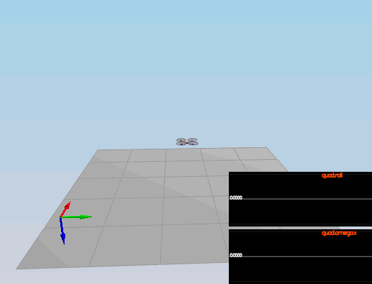

# FCND-3D-Quadrotor-Controller
In this project, a complete cascaded controller is going to be implemented in C++. Part of the control design relies on some math that one can find on the following paper [Feed-Forward Parameter Identification for Precise Periodic
Quadrocopter Motions](http://www.dynsyslab.org/wp-content/papercite-data/pdf/schoellig-acc12.pdf).

The diagram above summarizes the different control blocks that constitute the cascaded P and PD controllers.

## Simulator and C++ Implementation
Most of the code in this project can be found in [FCND-Controls-CPP](https://github.com/bwassim/FCND-3D-Quadrotor-Controller/tree/master/FCND-Controls-CPP) folder. The main file for coding the controller is [src/QuadControl.cpp](https://github.com/bwassim/FCND-3D-Quadrotor-Controller/tree/master/FCND-Controls-CPP/src). All the configuration files for the controller and the vehicle are in the `config` directory. All the tunning parameters will be done in the file called `QuadControlParams.txt`. We will be using the simulator to fly different trajectories to test out the performance of the C++ controllers. These trajectories can be found in `traj` repo.
### Prerequisites
If you are using a mac, Xcode would be enough to run the project. Otherwise follow the prerequisites in the seed project's [README](https://github.com/udacity/FCND-Controls-CPP) fil

### The Simulator 
After running the project, in the simulator window itself, you can right click the window to select between a set of different scenarios that are designed to test the different parts of your controller.
The simulation (including visualization) is implemented in a single thread. This is so that you can safely breakpoint code at any point and debug, without affecting any part of the simulation.
Vehicles are created and graphs are reset whenever a scenario is loaded. When a scenario is reset (due to an end condition such as time or user pressing the `R` key), the config files are all re-read and state of the simulation/vehicles/graphs is reset -- however the number/name of vehicles and displayed graphs are left untouched.
e.
### Testing it out
When you run the simulator, you'll notice your quad is falling straight down. This is due to the fact that the thrusts are simply being set to:
`QuadControlParams.Mass * 9.81 / 4`. Therefore, if the mass doesn't match the actual mass of the quad, it'll fall down.
It can be verified that a mass = 0.24 [kg] will make the vehicle hover for short period of time. 
### Objectives
We would like to design the different controller blocks in order to control the drone in 3D. To do this we need to proceed with the following steps 
1. Implement a Body rate controller
2. Implement a roll/pitch controller 
3. Implement an altitude controller 
4. Implement a lateral position controller
5. Implement a yaw controller.

### Scenario 2: Body rate control
For the attitude control, scenario 2 will be used in the simulation. The body rate control will stabilize the rotational motion and bring the vehicle back to level altitude.
Initially we start by implementing the body rate controller. The latter generates the command Moment as follows 
- Calculate the error between the desired and current body rate
- generate the moment command vector as follows 

Notice that we have used a P controller for the body rates p, q, r. [BodyRateControl](https://github.com/bwassim/FCND-3D-Quadrotor-Controller/blob/552d921b647f1052275d90093f553645f029aa1f/FCND-Controls-CPP/src/QuadControl.cpp#L111-L117) function, that takes as argument the desired body rates pqrCmd and the current or estimated body rates.
Now that we have the moment command values, it is possible to derive the thrust in each rotor by solving the following set of equations

 

The result is coded in the [GenerateMotorCommands](https://github.com/bwassim/FCND-3D-Quadrotor-Controller/blob/552d921b647f1052275d90093f553645f029aa1f/FCND-Controls-CPP/src/QuadControl.cpp#L73-L82) function. We start by tunning the parameters kpPQR until we stabilize the rotation rate omega.x. 

 
sdfsdf

